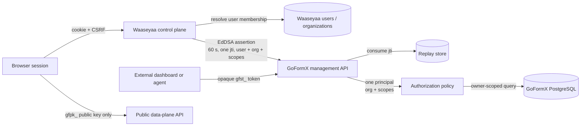

# ADR 0002: Separate first-party assertions from external service tokens

- Status: accepted
- Date: 2026-08-29
- Decision owners: GoFormX maintainers
- Tracks: goformx/goformx#126

## Context

GoFormX already authenticates server integrations with opaque, scoped `gfst_` service tokens. The Waaseyaa control plane adds human accounts, sessions, and application-owned organization memberships, but the Go data plane must not accept a browser session, share the control plane's cookie authority, or receive a long-lived service credential from browser code.

Treating the Waaseyaa server as just another `gfst_` integration would erase the acting human, encourage a broadly scoped shared secret, and make browser-to-server and server-to-server trust difficult to audit. Accepting identity headers without cryptographic binding would let callers invent users or organizations. GoFormX therefore needs two non-interchangeable credential classes that converge only after authentication on one least-privilege authorization principal.

## Decision

### Credential classification

Both credentials use `Authorization: Bearer`, but the verifier classifies the value exactly once before authentication:

1. A value beginning with `gfst_` is an external service token and is verified only by the opaque-token store.
2. A three-segment compact JWS whose protected header has `typ: gofx-fpa+jwt` is a first-party assertion and is verified only by the first-party verifier.
3. Everything else is unauthenticated. A failed verification in one class never falls back to the other class.

Public `gfpk_` form keys remain non-secret data-plane identifiers and are never accepted by either management security scheme.

### External service tokens

External dashboards, automations, and third-party agents continue using random `gfst_` tokens. Plaintext is returned once; GoFormX stores only the token hash, non-secret identifier, organization owner, exact scopes, lifecycle timestamps, rotation lineage, and usage audit metadata. Expiry, revocation, organization ownership, and route scope are checked on every request.

A service token represents an integration, not a human session. Its `owner_id` is the canonical GoFormX organization UUID. The token cannot be exchanged for a first-party assertion or used to create one.

### First-party assertion profile

The Waaseyaa server creates one assertion for one outbound management request after it has authenticated the browser session and resolved an active organization membership. The compact JWS profile is fixed as follows:

Protected header:

| Field | Requirement |
| --- | --- |
| `alg` | Exactly `EdDSA`; symmetric algorithms and `none` are rejected. |
| `typ` | Exactly `gofx-fpa+jwt`. |
| `kid` | Required opaque key identifier present in the configured verification set. Token-provided `jku`, `x5u`, and embedded `jwk` values are rejected. |

Claims:

| Claim | Requirement |
| --- | --- |
| `iss` | Exactly `https://goformx.com`. |
| `aud` | Exactly `https://api.goformx.com`; arrays and alternate audiences are rejected. |
| `sub` | Stable opaque Waaseyaa user UUID. Never an email address or display name. |
| `org` | Stable GoFormX organization UUID selected by server-side membership policy. |
| `scp` | Non-empty, duplicate-free array drawn from the same scope registry used by service tokens. |
| `iat` | NumericDate at signing time. |
| `nbf` | NumericDate equal to `iat`; the assertion is not valid early. |
| `exp` | NumericDate no more than 60 seconds after `iat`. |
| `jti` | Unique UUIDv4 generated for this assertion and consumed once. |
| `rid` | UUID request/correlation identifier propagated to audit records and logs. |
| `ver` | Integer `1`. Other versions are rejected until an ADR and verifier change introduce them. |

The verifier permits at most five seconds of clock skew when checking `iat`, `nbf`, and `exp`. It rejects assertions issued more than five seconds in the future, assertions older than their 60-second lifetime, or any claim set that does not match [the committed schema](../../goforms/contracts/auth/first-party-assertion.claims.schema.json). The schema is structural; the verifier owns temporal relationships, signature validation, replay state, key state, and resource ownership.

The assertion contains no form data, submission content, schema, secret, email address, display name, role list, IP address, user agent, or other unnecessary personal data. `sub`, `org`, `jti`, `rid`, and `kid` are safe identifiers for correlation but still receive the ordinary log-redaction and retention policy.

### Authorization convergence

Successful authentication produces the same internal principal shape regardless of credential class:

```text
credential_class: first_party_assertion | service_token
credential_id:    jti | service-token id
subject_id:       Waaseyaa user UUID | integration token id
organization_id: org | stored owner_id
scopes:           verified canonical scope set
request_id:       rid | server request id
```

Handlers authorize the required scope and constrain every repository query by `organization_id`. A valid signature or token never bypasses resource ownership. Object routes preserve uniform owner-scoped absence so a principal cannot distinguish a foreign UUID from a missing one. There is no agent, Waaseyaa, or first-party superuser scope.

### Replay prevention and failure behavior

Before a first-party request reaches a handler, GoFormX atomically inserts `(iss, jti)` into a replay table with `expires_at`, `first_seen_at`, `sub`, `org`, and `kid`. The pair is unique. A conflict rejects the request; the identifier remains consumed even if the downstream handler fails. Rows are removable only after `exp` plus the five-second skew window. Replay storage unavailability returns `503` and the operation does not proceed.

Authentication failures—malformed value, wrong class, algorithm, type, key, key state, issuer, audience, version, time, signature, or replay—return `401`. An authenticated principal lacking a required scope returns `403`. Owner-scoped resource mismatch uses the operation's uniform `404` behavior. Responses do not reveal which key, claim, token, owner, or replay check failed.

### Key custody, discovery, and rotation

The Ed25519 private key exists only in the Waaseyaa deployment's server-side secret custody. It is never stored in GoFormX, committed, logged, placed in environment delivered to a browser, or returned by an API. GoFormX holds public verification keys and explicit state (`next`, `active`, `retiring`, or `revoked`).

Waaseyaa publishes public keys at `https://goformx.com/.well-known/goformx-control-plane-jwks.json`. GoFormX production configuration pins the issuer, audience, JWKS URL, and allowed algorithm. The verifier uses a cached/configured verification set, refreshes at most once when it sees an unknown `kid`, and never follows discovery URLs supplied by a token. A deployable JWKS snapshot provides cold-start verification when discovery is temporarily unavailable.

Normal rotation is testable and ordered:

1. Generate a new key in Waaseyaa custody with state `next` and publish its public JWK.
2. Refresh GoFormX and prove both the active and next public keys verify fixtures.
3. Promote the new key to `active`, move the previous key to `retiring`, and begin signing with the new `kid`.
4. Keep the retiring public key for at least 65 seconds (maximum assertion lifetime plus skew), then remove it.
5. Prove an assertion from the removed key is rejected while the active key continues to pass.

Emergency revocation marks a `kid` revoked in GoFormX immediately, disables first-party assertion acceptance if the incident scope is unknown, rotates Waaseyaa signing custody, and only then restores traffic. Revoked keys are rejected even when their signatures and times are otherwise valid. Outstanding assertions need no per-user revocation service because they live for at most 60 seconds; a specific `jti` may also be deny-listed during investigation. External `gfst_` tokens have independent database revocation and are unaffected by assertion-key rotation.

## Trust-boundary diagram



The browser-to-Waaseyaa session boundary, Waaseyaa-to-GoFormX assertion boundary, and external-token boundary are independent. The browser never receives either management credential.

## Consequences

- #119 must publish both OpenAPI security schemes and annotate every management operation with one canonical required scope.
- #120 must implement assertion verification, replay persistence, key-state handling, principal convergence, and negative tests without replacing `gfst_` tokens.
- The Waaseyaa control plane needs Ed25519 signing custody and a JWKS endpoint, but does not need access to GoFormX token hashes or PostgreSQL.
- Adding claims, algorithms, audiences, versions, or scopes is a contract change requiring fixtures, negative tests, OpenAPI updates, and an ADR amendment.

