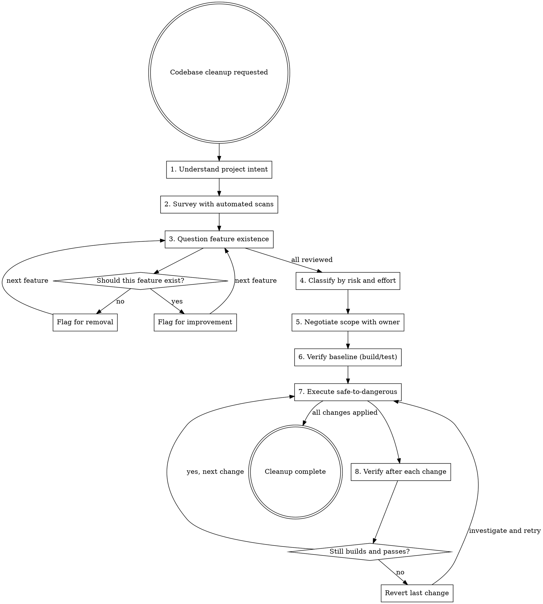

# Cleaning Up Codebases

## Overview

Systematic codebase cleanup that asks "should this exist?" before "how can I improve this?" The core failure mode in cleanup is refactoring code that should be deleted, or adding new abstractions to an already over-abstracted mess.

**Core principle:** Removal over refactoring. Simplification over restructuring. Verify before and after every change.

## When to Use

- Vibe-coded project that has grown organically
- Codebase with suspected dead code, half-finished features, or scope creep
- Project where code has drifted from documented architecture
- Pre-refactor audit to identify what's worth keeping
- New-to-you codebase that needs understanding before modification

**When NOT to use:**
- Greenfield project (nothing to clean)
- Single targeted bug fix (too narrow for full audit)
- Performance optimization (different skill, different methodology)

## Process

### Step 1: Understand Project Intent

**Before touching code, understand what the project is SUPPOSED to be.**

Read in this order:
1. README.md / CLAUDE.md - stated purpose and architecture
2. Design docs / planning docs - original vision
3. Git log (recent commits) - what's actively being worked on
4. Dependency manifest (`package.json`, `go.mod`, `Cargo.toml`, `requirements.txt`, etc.) — actual scope

**What you're looking for:** The gap between stated intent and actual code. Features that exist in code but aren't mentioned in docs are candidates for removal.

### Step 2: Survey with Automated Scans

Run systematic searches. Don't rely on reading files one by one. **Count what you find** — concrete numbers ("23 TODO comments, 4 unused files") are more actionable than vague impressions ("lots of dead code").

**Dead code signals:**
- Unused imports/modules (compiler warnings, `grep` for module declarations vs. uses)
- Functions/types defined but never called (search for definition, then search for usages)
- Files that nothing imports
- Feature flags or "coming soon" placeholders
- Commented-out code blocks
- Alternate implementations (e.g., `app_v2.js` alongside `app.js`, or `layout_old.html`)

**Code quality signals:**
- Unhandled errors — bare exception catches, empty `catch {}`, `except: pass`, `.unwrap()` in non-test code
- `TODO` / `FIXME` / `HACK` / `XXX` comments
- Functions over 100 lines
- Files over 500 lines
- Duplicated logic across files

**Scope creep signals:**
- Features unrelated to the project's stated purpose
- Entire modules or packages that could be separate projects
- Dependencies pulled in for a single non-core feature

**Language-specific signals (adapt to your stack):**
- **JavaScript/TypeScript:** `console.log` left in production, `any` type overuse, unused dependencies in `package.json`
- **Python:** bare `except:` clauses, unused imports (`ruff` or `flake8`), `# type: ignore` without explanation
- **Go:** unchecked errors (`_ = someFunc()`), unused variables, empty `if err != nil` blocks
- **Rust:** `unwrap()` / `expect()` in non-test code, unused `use` declarations
- **HTML/CSS/Static sites:** orphaned images/assets, dead internal links, unused CSS rules, commented-out markup

### Step 2b: Establish a Clean Baseline (Lint, Test, Build)

**Before you can evaluate the code, make sure the toolchain is healthy.**

Run every standard check the project supports and record the results:
1. **Linter** — `eslint .`, `ruff check .`, `golangci-lint run`, `clippy`, etc. Record warning/error count.
2. **Tests** — `npm test`, `pytest`, `go test ./...`, etc. Record pass/fail count.
3. **Build** — `npm run build`, `go build`, `cargo build`, `hugo build`, etc. Record warnings.
4. **Also capture:** dependency count, bundle size (frontend), total lines of code.

These numbers are your baseline. After cleanup, the delta tells the story: "removed 1,200 lines, 3 unused dependencies, and 47 lint warnings."

**What you're looking for:**
- **Linter warnings nobody fixed** — these reveal patterns the team stopped caring about
- **Failing or skipped tests** — dead tests are worse than no tests (false confidence)
- **Build warnings** — deprecation notices, unused variable warnings, type mismatches

If any of these are broken, **that's your first finding**. A codebase that doesn't pass its own checks has a foundation problem.

### Step 2c: Evaluate at Macro and Micro Levels

**Macro (project-level):**
- Does the directory structure match the project's architecture? Or has it drifted?
- Are there modules/folders that overlap in responsibility?
- Do config files (CI, linter rules, editor configs) reflect current practices or are they stale?
- Are linter/formatter rules actually enforced, or are they ignored with `// nolint`, `// eslint-disable`, `# noqa`?

**Micro (file/function-level):**
- Are tests testing behavior or just chasing coverage numbers?
- Are there tests that always pass regardless of implementation (useless tests)?
- Do test names describe what they verify, or are they `test1`, `test2`?
- Are there god files — one file doing 5 unrelated things?
- Is there copy-paste code that should be a shared function (or vice versa — premature abstractions)?

**Rules and config evaluation:**
- Are there linter rules that are disabled project-wide? Why?
- Are there CI steps that are skipped or `allow_failure`?
- Do `.gitignore`, `.dockerignore`, editor configs match reality?
- Are there config files for tools the project no longer uses?

### Step 3: Question Feature Existence

For EVERY major feature or module, ask:

1. **Does this align with the project's stated purpose?** If not, it's a removal candidate.
2. **Is this actively used?** Trace call paths from entry points.
3. **Could this be a separate project/library?** If yes, consider extraction or removal.
4. **Was this fully implemented?** Half-finished = remove unless owner wants to complete it.

**NEVER default to "refactor this to be better." The first question is always "should this exist at all?"**

**For code that SHOULD exist but is messy:**
- **Refactor** if the feature is core and has tests (or is testable).
- **Rewrite** if the feature is core but untestable or small enough to redo cleanly.
- **Remove** if the feature is unused, undocumented, or unjustified.

### Step 4: Classify Findings

Separate findings into tiers. Do NOT mix quick wins with multi-week projects.

| Tier | Description | Examples | Typical effort |
|------|-------------|----------|----------------|
| **T1: Safe deletes** | Dead code, unused files, abandoned experiments | Unused plugin system, alternate UI files | 5–30 min |
| **T2: Quick fixes** | Isolated improvements, no architectural impact | Add missing error handling, remove stale TODOs, fix linter warnings | 1–3 hours |
| **T3: Focused refactors** | Targeted improvements to specific modules | Extract god object, consolidate duplicated logic | 1–3 days |
| **T4: Architectural changes** | Structural changes affecting multiple modules | Change state management pattern, redesign module boundaries | Scheduled project |

**Timebox each tier.** If a T1 delete is taking hours, it's probably a T2. If a T3 refactor is stretching past days, stop and re-scope with the owner. Cleanup that exceeds its timebox is turning into a rewrite.

### Step 5: Negotiate Scope with Owner

**Present findings to the user before creating any plan.** Ask:

- "I found X features that seem outside the project's core purpose. Which do you want to keep?"
- "Here are N things I can safely delete right now. Should I proceed?"
- "These T3/T4 items need your input on direction. Which matter to you?"

**Never assume what the owner values.** A "questionable" feature might be their favorite part.

### High-Risk Areas (Do Not Modify Without Owner Approval)

Some things *look* like cleanup targets but are dangerous to touch:

- Migration scripts (even old ones — rollback paths may depend on them)
- Legacy API endpoints still consumed by external clients
- Feature flags tied to business logic or A/B tests
- Infrastructure glue (CI configs, deployment scripts, IaC)
- Code behind active experiments
- Anything with `DO NOT DELETE` / `KEEP` comments (take them seriously)

If it's ugly but load-bearing, leave it alone until you've confirmed with the owner.

### Step 6: Verify Baseline

Re-run the checks from Step 2b immediately before you start making changes. If time has passed or others have committed, your baseline may have shifted. Confirm build, tests, and lint all still match your earlier snapshot.

**If anything regressed since Step 2b, fix that first.** Don't add cleanup on top of a broken build.

### Step 7: Execute Safe-to-Dangerous

**Order of operations:**
1. **T1 first:** Delete dead code, unused files, abandoned experiments
2. **T2 next:** Quick isolated fixes
3. **T3 then:** Focused refactors with tests
4. **T4 last:** Architectural changes (may deserve their own branch)

**After each change:** Build and test. If broken, revert and investigate.

### Step 8: Verify After Each Change

Not "at the end." After EACH significant change:
- Build passes
- Tests pass
- No new warnings introduced
- Docs still reflect reality (update if you removed something they reference)
- Commit the working state

## Definition of Done

Cleanup is complete when:
- All agreed-upon T1/T2 items are resolved
- Lint, test, and build results are **equal to or better than** your baseline from Step 6
- No unused dependencies remain
- Removed features are no longer referenced in docs or config
- Owner has signed off on the final state

This is "improvement over baseline," not "perfection." A codebase with 200 lint warnings that you brought down to 40 is a successful cleanup.

## Common Mistakes

| Mistake | What to do instead |
|---------|-------------------|
| Refactoring code that should be deleted | Ask "should this exist?" first |
| Adding new abstractions during cleanup | Cleanup means LESS code, not different code |
| Planning a 5-phase multi-week cleanup | Start with T1 deletes. Reassess after. |
| Suggesting removal without checking dependencies | `grep` for all usages before flagging as dead |
| Treating all issues as equal priority | Use the tier system. T1 before T2 before T3. |
| Skipping baseline verification | Always know if it builds before you start |
| Not involving the owner in scope decisions | Present findings, don't prescribe solutions |
| Going file-by-file instead of scanning | Use grep/glob for patterns across the whole codebase |

## Red Flags - You're Doing Cleanup Wrong

- You're writing MORE code than you're deleting
- You're creating new files during a cleanup
- You suggested an "event bus" or "registry pattern" during a dead code removal
- Your cleanup plan has 5+ phases spanning weeks
- You haven't asked the owner what they want to keep
- You haven't verified the build passes yet
